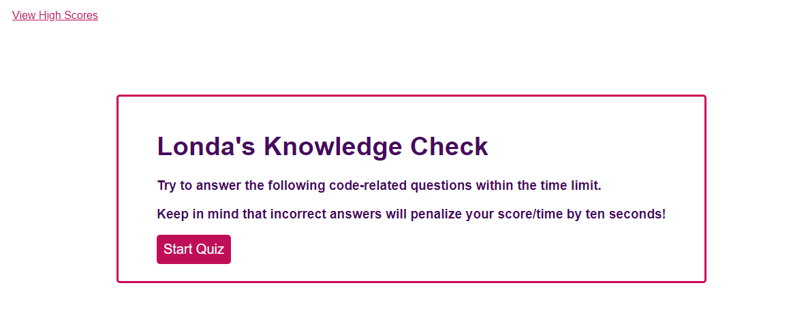

# Londa-q-codefun

## Action Needed
Create a quiz that uses HTML, CSS, and JS functionality. The final result will give you  questions that need to be asnwered within a time frame. Once completed you will be given a score as well as the number of correct/incorrect answers.

## Actions Taken
* Create individual files to support the functionality of the quiz
* Created basic HTML file that includes the needed criteria for the quiz
* Added additional HTML to keep record of high scores
* Added timing functions to account for time to take quiz
* Added functions that satisfies criteria for right/wrong answers
* Customized CSS to make it more Londa 

## Link

## Screenshot
